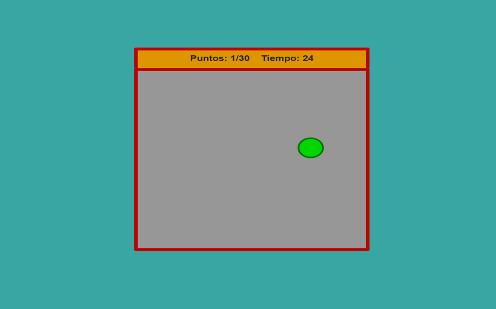

# Pointer Game

This project is a game of skill and speed where the goal is to score points by hovering over a circle until reaching 30 before the time runs out.

## Technologies Used

- HTML
- CSS
- JavaScript

## Usage Instructions

1. Clone this repository to your computer.
2. Open the `index.html` file in a web browser.
3. Hover over the circle to score points.
4. Try to reach 30 points before the time runs out.

## Contributing

This project is open for contributions. If you would like to collaborate, please submit a pull request and describe your changes.

Enjoy!

## Screenshot

  

